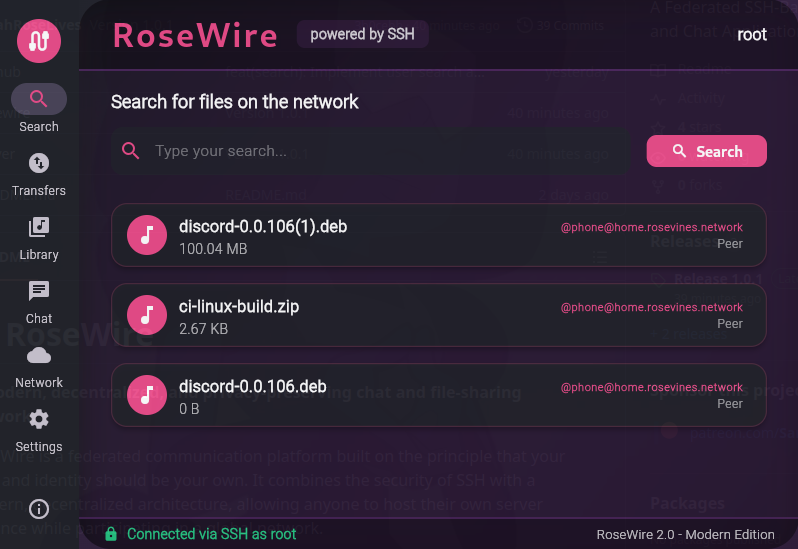

# 🌹 RoseWire

**A modern, decentralized, and privacy-preserving chat and file-sharing network.**

RoseWire is a federated communication platform built on the principle that your data and identity should be your own. It combines the security of SSH with a modern, decentralized architecture, allowing anyone to host their own server instance while participating in a global network.

You can find the 1st ever instance running at https://rosevines.network/

---



---

## ✨ Features

- **Federated Chat**  
  Engage in a global chat with users from any instance on the network. Your identity (`@nickname@instance.domain`) is portable and unique.

- **Decentralized File Sharing**  
  Share files from your library with the entire network. Search and download files shared by any user on any connected server.

- **Privacy-Preserving Transfers**  
  All cross-instance file transfers are proxied through the users' home servers. Your personal IP address is never exposed to another instance or its users during a download.

- **Automatic Peer Discovery**  
  Powered by a gossip protocol, new server instances can automatically discover and connect to the network using just one initial bootstrap peer. This creates a resilient, self-organizing mesh.

- **Secure Client-Server Communication**  
  All communication between your client and your home server is encrypted end-to-end over a standard SSH connection.

---

## 🌐 How Federation Works in RoseWire

RoseWire's architecture is federated—a network of independent servers that talk to each other. Users connect to a home instance, and that instance communicates with its peers on their behalf. This ensures both decentralization and privacy.

The federation is built on four key components:

1. **Global Identity (`@user@domain`)**  
   A user's identity is a global address tied to their home instance, allowing anyone on any server to uniquely identify and interact with them.

2. **WebFinger for Discovery**  
   When one server needs to verify a user from another instance, it uses the standard WebFinger protocol. This makes a public HTTPS request to the user's home instance to retrieve their public key and profile info—confirming identity without a central directory.

3. **ActivityPub-Inspired S2S API**  
   Server-to-server communication is modeled after the ActivityPub protocol. When a user acts (sending a chat or sharing a file), their server wraps it in a JSON "Activity" and pushes it to the inboxes of all known peer servers. This push-based model proactively distributes information across the network.

4. **Gossip Protocol for Peer Discovery**  
   No central list of servers needed! Instances use a gossip protocol to find each other. Periodically, a server asks a random peer for its list of known peers, then adds any new ones. This info spreads organically, letting the network grow and heal automatically.

---

## 🔒 Security & Privacy by Design

RoseWire is architected to protect user privacy, especially against IP address disclosure during file transfers.

### 🛡️ The Trusted Proxy Model

Direct client-to-client connections are strictly forbidden.

**The data flow for file sharing:**
```
Uploader → Instance B → Instance A → Downloader
```
- The downloader's client requests a file from their own server (Instance A).
- Instance A makes a server-to-server request to Instance B.
- Instance B requests the file from the uploader's client.
- The file is streamed: uploader → instance B → instance A → downloader.

**Result:**  
Uploader and Instance B only see the IP of Instance A. The downloader's personal IP is never revealed! This model places bandwidth cost on instance operators as a necessary trade-off for guaranteed user privacy.

### 🔑 SSH Foundation

All communication between a user's client application and their home instance is tunneled through an SSH connection. This provides robust, industry-standard encryption for all chats, commands, and file transfer initializations.

---

## 🚀 Future Roadmap

While the core functionality is complete, several areas are targeted for future improvement:

- **Federated User Profiles**  
  Implement the `GET /api/s2s/user/{user_address}` endpoint to allow viewing basic profile information of users on other instances.

- **Private Messaging**  
  Develop one-to-one private messaging using a combination of S2S relays and key-based encryption.

- **Enhanced S2S Authentication**  
  Upgrade S2S authentication from the current shared secret to a model where each instance signs outgoing requests with a dedicated private key.

- **Client-Side Refinements**  
  Improve the UI/UX of desktop and mobile clients, with better error handling for federated actions and smoother user experience.

---

## 🤝 Contributing

Interested in helping build the future of private, federated communication? Check out our issues, fork the repo, and send a PR! We welcome your input.

---

## 💬 Community

Questions? Ideas? Join the discussion on our community chat or open an issue!

---